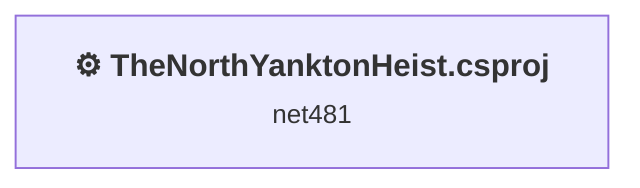
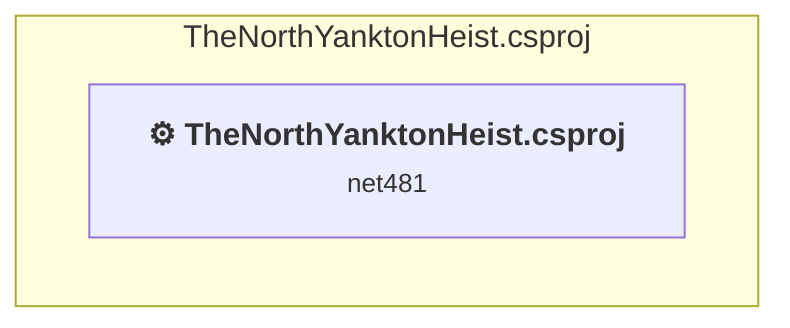

# Projects and dependencies analysis

This document provides a comprehensive overview of the projects and their dependencies in the context of upgrading to .NETCoreApp,Version=v8.0.

## Table of Contents

- [Executive Summary](#executive-Summary)
  - [Highlevel Metrics](#highlevel-metrics)
  - [Projects Compatibility](#projects-compatibility)
  - [Package Compatibility](#package-compatibility)
  - [API Compatibility](#api-compatibility)
- [Aggregate NuGet packages details](#aggregate-nuget-packages-details)
- [Top API Migration Challenges](#top-api-migration-challenges)
  - [Technologies and Features](#technologies-and-features)
  - [Most Frequent API Issues](#most-frequent-api-issues)
- [Projects Relationship Graph](#projects-relationship-graph)
- [Project Details](#project-details)

  - [TheNorthYanktonHeist\TheNorthYanktonHeist.csproj](#thenorthyanktonheistthenorthyanktonheistcsproj)

## Executive Summary

### Highlevel Metrics

| Metric | Count | Status |
| :--- | :---: | :--- |
| Total Projects | 1 | All require upgrade |
| Total NuGet Packages | 0 | All compatible |
| Total Code Files | 44 |  |
| Total Code Files with Incidents | 3 |  |
| Total Lines of Code | 11581 |  |
| Total Number of Issues | 51 |  |
| Estimated LOC to modify | 49+ | at least 0.4% of codebase |

### Projects Compatibility

| Project | Target Framework | Difficulty | Package Issues | API Issues | Est. LOC Impact | Description |
| :--- | :---: | :---: | :---: | :---: | :---: | :--- |
| [TheNorthYanktonHeist\TheNorthYanktonHeist.csproj](#thenorthyanktonheistthenorthyanktonheistcsproj) | net481 | 🟡 Medium | 0 | 49 | 49+ | ClassicWinForms, Sdk Style = False |

### Package Compatibility

| Status | Count | Percentage |
| :--- | :---: | :---: |
| ✅ Compatible | 0 | 0.0% |
| ⚠️ Incompatible | 0 | 0.0% |
| 🔄 Upgrade Recommended | 0 | 0.0% |
| ***Total NuGet Packages*** | ***0*** | ***100%*** |

### API Compatibility

| Category | Count | Impact |
| :--- | :---: | :--- |
| 🔴 Binary Incompatible | 49 | High - Require code changes |
| 🟡 Source Incompatible | 0 | Medium - Needs re-compilation and potential conflicting API error fixing |
| 🔵 Behavioral change | 0 | Low - Behavioral changes that may require testing at runtime |
| ✅ Compatible | 12437 |  |
| ***Total APIs Analyzed*** | ***12486*** |  |

## Aggregate NuGet packages details

| Package | Current Version | Suggested Version | Projects | Description |
| :--- | :---: | :---: | :--- | :--- |

## Top API Migration Challenges

### Technologies and Features

| Technology | Issues | Percentage | Migration Path |
| :--- | :---: | :---: | :--- |
| Windows Forms | 49 | 100.0% | Windows Forms APIs for building Windows desktop applications with traditional Forms-based UI that are available in .NET on Windows. Enable Windows Desktop support: Option 1 (Recommended): Target net9.0-windows; Option 2: Add <UseWindowsDesktop>true</UseWindowsDesktop>; Option 3 (Legacy): Use Microsoft.NET.Sdk.WindowsDesktop SDK. |

### Most Frequent API Issues

| API | Count | Percentage | Category |
| :--- | :---: | :---: | :--- |
| T:System.Windows.Forms.Keys | 24 | 49.0% | Binary Incompatible |
| P:System.Windows.Forms.KeyEventArgs.KeyCode | 8 | 16.3% | Binary Incompatible |
| T:System.Windows.Forms.KeyEventHandler | 4 | 8.2% | Binary Incompatible |
| T:System.Windows.Forms.Clipboard | 2 | 4.1% | Binary Incompatible |
| M:System.Windows.Forms.Clipboard.SetText(System.String) | 2 | 4.1% | Binary Incompatible |
| T:System.Windows.Forms.KeyEventArgs | 1 | 2.0% | Binary Incompatible |
| F:System.Windows.Forms.Keys.I | 1 | 2.0% | Binary Incompatible |
| F:System.Windows.Forms.Keys.K | 1 | 2.0% | Binary Incompatible |
| F:System.Windows.Forms.Keys.L | 1 | 2.0% | Binary Incompatible |
| F:System.Windows.Forms.Keys.O | 1 | 2.0% | Binary Incompatible |
| F:System.Windows.Forms.Keys.B | 1 | 2.0% | Binary Incompatible |
| F:System.Windows.Forms.Keys.NumPad9 | 1 | 2.0% | Binary Incompatible |
| F:System.Windows.Forms.Keys.NumPad7 | 1 | 2.0% | Binary Incompatible |
| F:System.Windows.Forms.Keys.N | 1 | 2.0% | Binary Incompatible |

## Projects Relationship Graph

Legend:
📦 SDK-style project
⚙️ Classic project

## Project Details

### TheNorthYanktonHeist\TheNorthYanktonHeist.csproj

#### Project Info

- **Current Target Framework:** net481
- **Proposed Target Framework:** net8.0-windows
- **SDK-style**: False
- **Project Kind:** ClassicWinForms
- **Dependencies**: 0
- **Dependants**: 0
- **Number of Files**: 44
- **Number of Files with Incidents**: 3
- **Lines of Code**: 11581
- **Estimated LOC to modify**: 49+ (at least 0.4% of the project)

#### Dependency Graph

Legend:
📦 SDK-style project
⚙️ Classic project

### API Compatibility

| Category | Count | Impact |
| :--- | :---: | :--- |
| 🔴 Binary Incompatible | 49 | High - Require code changes |
| 🟡 Source Incompatible | 0 | Medium - Needs re-compilation and potential conflicting API error fixing |
| 🔵 Behavioral change | 0 | Low - Behavioral changes that may require testing at runtime |
| ✅ Compatible | 12437 |  |
| ***Total APIs Analyzed*** | ***12486*** |  |

#### Project Technologies and Features

| Technology | Issues | Percentage | Migration Path |
| :--- | :---: | :---: | :--- |
| Windows Forms | 49 | 100.0% | Windows Forms APIs for building Windows desktop applications with traditional Forms-based UI that are available in .NET on Windows. Enable Windows Desktop support: Option 1 (Recommended): Target net9.0-windows; Option 2: Add <UseWindowsDesktop>true</UseWindowsDesktop>; Option 3 (Legacy): Use Microsoft.NET.Sdk.WindowsDesktop SDK. |

